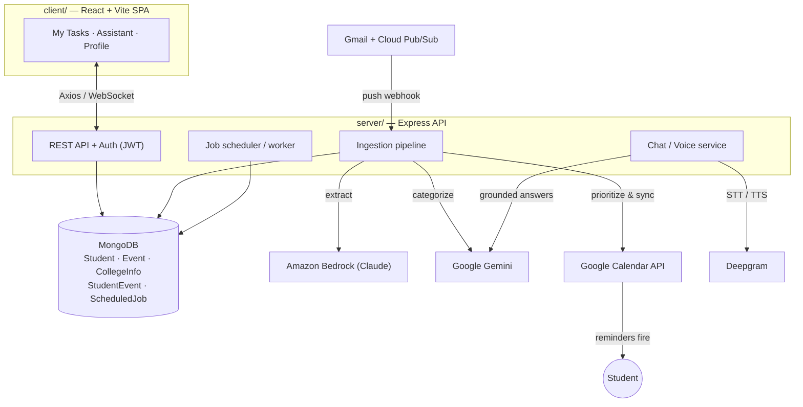

# CampusFlow

> Turns the flood of college emails, notices, and deadlines into a single
> prioritized task list — and pushes what matters into the student's Google
> Calendar so the reminders fire on their own.


<!-- TODO: add a CI build badge once a workflow is set up -->

Built for **HackOn with Amazon — Season 6.0** (AI for Campus, Community & Everyday Life).

---

## Overview

Students miss exams, deadlines, and fee dates because the important signals are
buried inside dozens of college emails and portal notices. **CampusFlow** ingests
those emails automatically, uses LLMs to extract and classify what each message
actually means, ranks every item by how much it matters to *that* student, and
writes the result straight into their Google Calendar — so the calendar itself
does the reminding. It also ships a chatbot and voice assistant grounded in the
student's own data, for questions like *"what's due this week?"* or *"make me a
study plan around my exams."*

It's built for college students (and the campus teams who notify them at scale).

## Live demo

🔗 **https://campusflow.dealance.app/**

> Tip: the app degrades gracefully. Without external API keys, extraction and
> categorization fall back to rule-based engines and calendar sync runs in
> simulation mode — so the full flow is demoable offline.

## Key features

- **Automatic email ingestion** — connect a Google account and college emails are
  pulled in via Gmail push (Pub/Sub); only messages from approved senders are read.
- **LLM extraction** — Amazon Bedrock (Claude) turns unstructured emails and
  attachments into structured events (dates, venues, fees, deadlines).
- **Smart categorization** — Google Gemini classifies each item (exams, deadlines,
  placements, fees, transport, events) into a per-student college digest.
- **Personalized prioritization** — every task is ranked by *importance × urgency*,
  surfacing things like low-attendance warnings and same-day deadline clashes first.
- **Calendar-native reminders** — confirmed items sync to Google Calendar with an
  importance-based reminder ladder; re-syncs are idempotent (no duplicates).
- **Grounded chatbot** — ask about deadlines, fees, or placements and get answers
  built only from the student's own data, plus on-demand study plans.
- **Voice assistant** — talk to the assistant with live speech-to-text and spoken
  replies (Deepgram STT + TTS).
- **Attachment parsing** — reads PDFs, `.docx`, `.doc`, and Excel timetables.
- **Offline-friendly fallbacks** — rule-based extraction/categorization and
  calendar simulation mode when API keys are absent.

## Tech stack

Pulled from the actual dependencies in `client/package.json` and `server/package.json`.

| Layer        | Technologies |
|--------------|--------------|
| **Frontend** | React 18, Vite 5, Tailwind CSS v4, React Router 6, Axios, react-markdown + remark-gfm, lucide-react |
| **Backend**  | Node.js 18+ (ESM), Express 4, Zod (validation), JSON Web Tokens (auth), Multer (uploads), Morgan (logging), `ws` (WebSocket voice stream) |
| **Database** | MongoDB via Mongoose 8 (`mongodb-memory-server` for zero-setup dev/tests) |
| **AI / LLM** | Amazon Bedrock — Claude (`@aws-sdk/client-bedrock-runtime`) for extraction · Google Gemini (Generative Language API) for categorization + chatbot · Deepgram (`nova-2` STT, `aura` TTS) for voice |
| **Integrations** | Google Calendar API v3 & Gmail (`googleapis`, OAuth2), Gmail push via Google Cloud Pub/Sub |
| **Infra / tooling** | ngrok (`@ngrok/ngrok`) for a public HTTPS webhook tunnel, dotenv for config, in-process job scheduler/worker, file parsers (`mammoth`, `word-extractor`, `xlsx`, `adm-zip`) |

JavaScript across the entire stack — no Python, no message broker. Every external
service (Bedrock, Gemini, Google, Deepgram) has a graceful fallback so the MVP runs
without credentials.

## Architecture

CampusFlow is a two-app monorepo: a React SPA (`client/`) and an Express API
(`server/`) backed by MongoDB. Inbound college emails flow through a fixed pipeline
— **fetch → extract → categorize → prioritize → sync → notify** — and the same
structured data powers the task list, the chatbot, and the voice assistant.



**Flow:** Gmail publishes inbox changes to Pub/Sub, which hits the backend webhook.
The pipeline extracts structured events (Bedrock), categorizes them into a
per-student digest (Gemini), scores them by importance × urgency, and — on
confirmation — writes them to Google Calendar with a reminder ladder. The chatbot
and voice assistant answer from the same stored digest, never from invented facts.

## Getting started

### Prerequisites
- **Node.js 18+** (uses the built-in `fetch`)
- **MongoDB** — optional. The fastest path uses an in-memory MongoDB (below); for a
  persistent DB, use local `mongod` or a free MongoDB Atlas cluster.
- *(Optional)* API keys for Bedrock, Gemini, Google OAuth, and Deepgram to enable
  the real integrations. Without them, the app runs on fallbacks.

### 1. Backend (`server/`)

Zero-config path — spins up its own in-memory MongoDB (data resets on restart):

```bash
cd server
npm install
npm run dev:mem        # API on http://localhost:4000
```

Or run against a real MongoDB:

```bash
cd server
npm install
cp .env.example .env   # fill in MONGODB_URI (other keys optional)
npm run dev            # http://localhost:4000
```

Visit `http://localhost:4000/health` — it reports which engines are live
(`bedrock` vs rule-based, Gemini vs fallback, calendar configured vs simulation,
voice enabled/disabled).

### 2. Frontend (`client/`)

```bash
cd client
npm install
cp .env.example .env   # VITE_API_BASE_URL defaults to http://localhost:4000
npm run dev            # http://localhost:5173
```

### Environment variables (`server/.env`)

All AI/integration keys are **optional** — leave them blank to use fallbacks.

| Variable | Required | Purpose |
|----------|----------|---------|
| `MONGODB_URI` | Recommended* | MongoDB connection string (Atlas or local). |
| `JWT_SECRET` | Recommended | Secret for signing auth tokens. |
| `PORT` / `FRONTEND_URL` | No | Server port (4000) and CORS/redirect origin. |
| `AWS_REGION`, `BEDROCK_API_KEY`, `BEDROCK_MODEL_ID` | No | Amazon Bedrock (Claude) extraction. Blank → rule-based fallback. |
| `GEMINI_API_KEY`, `GEMINI_MODEL` | No | Gemini categorizer + chatbot. Blank → rule-based fallback. |
| `GOOGLE_CLIENT_ID`, `GOOGLE_CLIENT_SECRET`, `GOOGLE_REDIRECT_URI` | No | Google OAuth for Calendar + Gmail. Blank → calendar simulation. |
| `GMAIL_PUBSUB_TOPIC`, `GMAIL_PUBSUB_TOKEN`, `GMAIL_ALLOWED_SENDERS` | No | Gmail push via Cloud Pub/Sub. Blank → Gmail push disabled. |
| `DEEPGRAM_API_KEY`, `DEEPGRAM_STT_MODEL`, `DEEPGRAM_TTS_MODEL` | No | Voice assistant (STT + TTS). Blank → voice disabled. |
| `NGROK_AUTHTOKEN`, `NGROK_DOMAIN` | No | Public HTTPS tunnel for the Pub/Sub webhook. |

> *\*TODO: the bundled config currently hard-codes a development MongoDB URI in
> `server/src/config/env.js`. Replace it with your own `MONGODB_URI` before
> deploying, and rotate the committed credential.*

Frontend (`client/.env`): only `VITE_API_BASE_URL`.

### Useful scripts

| Location | Command | What it does |
|----------|---------|--------------|
| `server` | `npm run dev` / `npm run dev:mem` | Run API (real DB / in-memory DB). |
| `server` | `npm run dev:tunnel` | Run API + open an ngrok HTTPS tunnel. |
| `server` | `npm run worker` | Run the background job worker standalone. |
| `server` | `npm run smoke` | End-to-end pipeline test (in-memory DB, no external services). |
| `server` | `npm run test:http` / `npm run test:jobs` | HTTP-flow and job tests. |
| `client` | `npm run dev` / `build` / `preview` | Vite dev server / production build / preview. |

## Screenshots / demo

<!-- TODO: drop real images into a docs/ or assets/ folder and update these paths -->

| My Tasks (prioritized) | Assistant (chat + voice) |
|------------------------|--------------------------|
|  |  |

> TODO: add a short demo GIF or video walkthrough link here.

## Project status / roadmap

**Status:** Working MVP built for HackOn with Amazon — Season 6.0. End-to-end flow
(ingest → extract → categorize → prioritize → calendar sync), chatbot, and voice
assistant all function, with offline fallbacks for every external service.

**Roadmap**
- [ ] Replace the hard-coded dev MongoDB URI with env-only config and rotate secrets.
- [ ] Add automated CI (lint + the existing `smoke` / `test:http` suites).
- [ ] Broaden ingestion beyond Gmail (direct college-portal connectors).
- [ ] Multi-node deployment guide (dedicated `worker` + `INLINE_JOBS=false`).
- [ ] Containerize (Dockerfile + compose) for one-command setup.

---

<sub>Repo layout — `server/` Express API (auth, profile, portal, Gmail ingestion,
extraction, digest, chat, voice, calendar, jobs, models) · `client/` React + Vite
SPA (My Tasks, Assistant, Profile).</sub>
